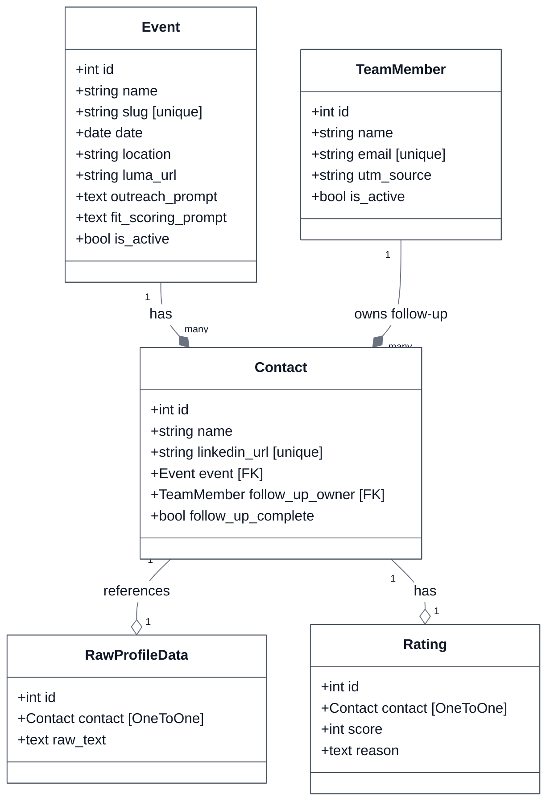
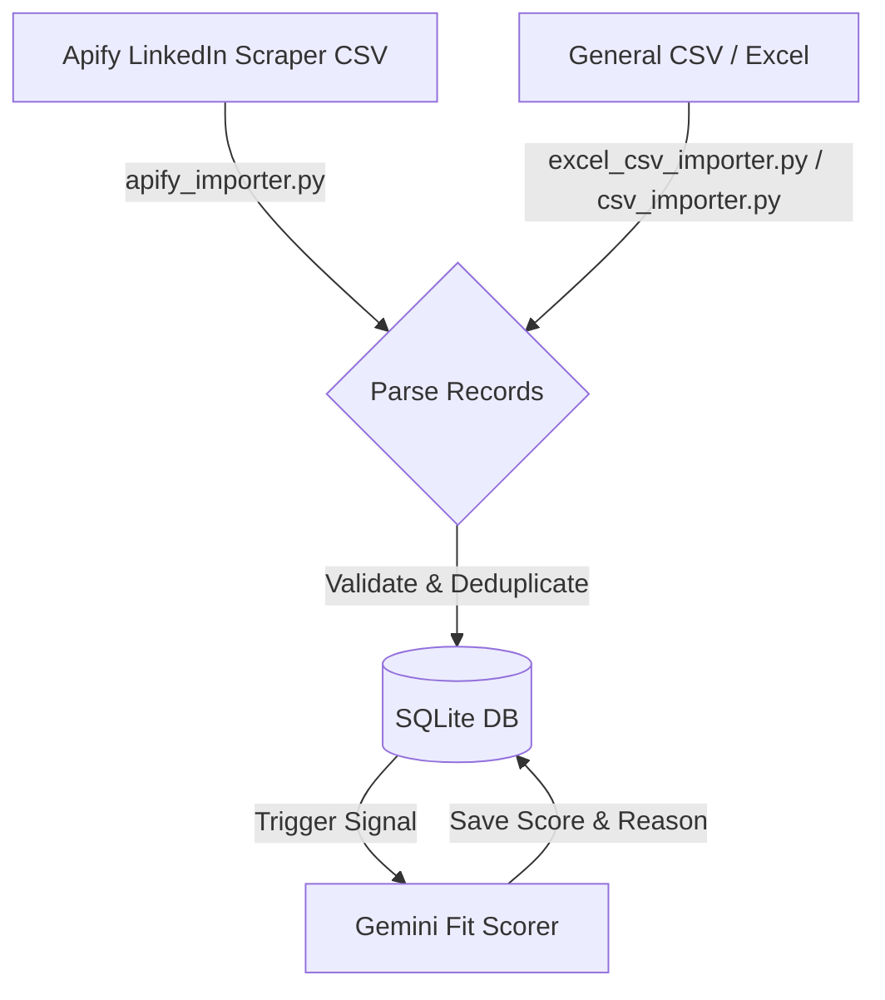
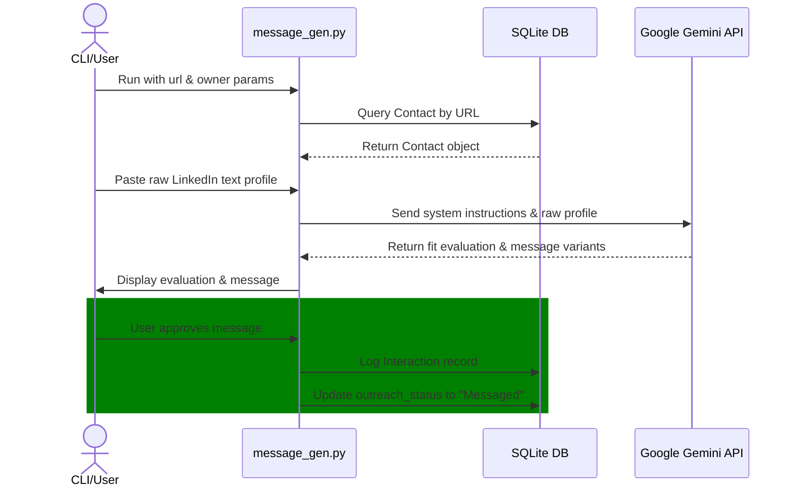
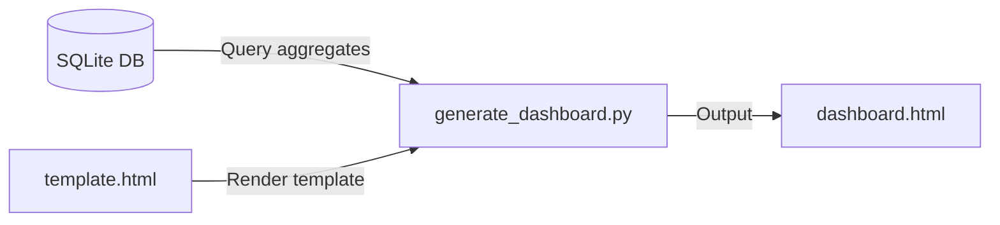

# TEG CRM Backend Architecture

This document provides a comprehensive, code-level architectural reference of the **TEG CRM** backend service (`teg-crm/`). It details the Django API engine, database models, serializers, views, and standalone CLI utilities.

For a full-stack context, the system consists of a Vite React frontend ([teg-crm-web](file:///d:/TEGProjects/TEGCRM/teg-crm-web/)) communicating with this Django REST API backend via JWT. Both services persist data into a shared SQLite database located at `data/db.sqlite3`.

---

## 📂 Backend Directory Tree

Below is the file layout of the backend engine:

```text
teg-crm/
├── crm/                         # Django Project Settings & Application
│   ├── contacts/                # Core Django App
│   │   ├── admin.py             # Custom Django admin configurations
│   │   ├── apps.py              # App config metadata
│   │   ├── models.py            # Django ORM schema definitions & signals
│   │   ├── serializers.py       # DRF serializers
│   │   └── views.py             # REST API views, viewsets, & custom actions
│   ├── settings.py              # Django settings (JWT, SQLite, CORS)
│   ├── urls.py                  # API routing definitions
│   └── wsgi.py                  # WSGI entrypoint
├── src/                         # Standalone python services & utilities
│   ├── config.py                # Environment configuration loader
│   ├── dashboard/               # HTML pipeline dashboard generator
│   │   ├── generate_dashboard.py
│   │   └── template.html
│   ├── importer/                # CSV, Excel & Apify importer scripts
│   │   ├── apify_importer.py
│   │   ├── csv_importer.py
│   │   └── excel_csv_importer.py
│   └── linkedin/                # LinkedIn automation & message generation
│       ├── apollo_importer.py
│       ├── contact_logger.py
│       ├── message_gen.py
│       └── outreach_queue.py
├── config/                      # Local JSON config (team.json)
├── data/                        # SQLite storage directory (db.sqlite3)
└── tests/                       # Pytest unit and integration test suites
```

---

## 🛠️ Django REST API Engine (`crm/`)

The REST API layer is built on **Django** and **Django REST Framework (DRF)**.

### 1. Project Configurations

* **[settings.py](file:///d:/TEGProjects/TEGCRM/teg-crm/crm/settings.py)**:
  - **Database Persistence**: Configures the default SQLite database engine mapping to `data/db.sqlite3`. Under Docker environment, this maps to a shared, persistent container volume to prevent data loss.
  - **SimpleJWT Auth**: Integrates `rest_framework_simplejwt` to secure all REST endpoints. The authorization header type is configured as `Bearer` with a default 30-day token lifetime.
  - **CORS Management**: Includes `corsheaders` middleware allowing cross-origin resource sharing from the React frontend SPA.
  - **Gemini Key**: Resolves the `GEMINI_API_KEY` from environment variables for automated messaging.
* **[urls.py](file:///d:/TEGProjects/TEGCRM/teg-crm/crm/urls.py)**:
  - Exposes Django Admin on `/admin/`.
  - Configures explicit REST url endpoints by binding viewset actions to HTTP methods.

### 2. Core CRM Models ([models.py](file:///d:/TEGProjects/TEGCRM/teg-crm/crm/contacts/models.py))

The database schema reflects the CRM pipeline entities.



#### Code-Level Data Details & Signals
- **[Contact](file:///d:/TEGProjects/TEGCRM/teg-crm/crm/contacts/models.py)**: Represents an outreach prospect. Contains fields for the LinkedIn URL, an associated `Event`, and a `TeamMember` responsible for follow-up.
- **[Event](file:///d:/TEGProjects/TEGCRM/teg-crm/crm/contacts/models.py)**: Stores details about CRM events. Contacts are linked directly to events via a foreign key.
- **[Rating](file:///d:/TEGProjects/TEGCRM/teg-crm/crm/contacts/models.py)**: Stores AI-generated `score` ratings (1-5 scale) and the corresponding `reason` for the contact.
- **Asynchronous Scoring**: Triggered upon profile enrichment. The backend executes an asynchronous call to Google Gemini (`gemini-2.5-flash`) using the contact's parsed profile details to predict a fit score and output a rationale.

### 3. API Views & Custom Actions ([views.py](file:///d:/TEGProjects/TEGCRM/teg-crm/crm/contacts/views.py))

Backend APIs are exposed through DRF generic viewsets extending `viewsets.ModelViewSet`:

* **[LoginView](file:///d:/TEGProjects/TEGCRM/teg-crm/crm/contacts/views.py#L26)**: Exposes credentials authentication. It matches a static password configuration for backend console/panel access, returning JWT access and refresh tokens.
* **[EventViewSet](file:///d:/TEGProjects/TEGCRM/teg-crm/crm/contacts/views.py#L48)**: Manages CRM events keyed by unique slugs.
  - `@action import_leads`: Initiates bulk contact/attendee parsing from uploaded CSV or Excel spreadsheets using backend helper methods.
  - `@action test_prompt`: Generates 5 sample AI outreach variations for a mock contact to preview output quality for that event's prompt templates.
* **[AttendanceViewSet](file:///d:/TEGProjects/TEGCRM/teg-crm/crm/contacts/views.py#L120)**: Implements attendance lookups.
  - `@action generate_message`: Executes Gemini queries to produce personalized German LinkedIn messages based on outreach templates and contact properties. Disqualifies leads with a fit score of 2 or lower.
* **[ContactViewSet](file:///d:/TEGProjects/TEGCRM/teg-crm/crm/contacts/views.py#L186)**: Implements contacts CRUD, search filtering, and state mapping.
  - `@action extract_profile`: Accepts raw copy-pasted LinkedIn text from the browser extension, executes a zero-shot parsing instruction with Gemini, and returns structured profile parameters in strict JSON.
  - `@action enrich`: Stores raw profile data to `RawProfileData` and triggers the AI fit scorer on associated event attendances.
  - `@action export`: Packages matching contact listings into a downloadable Excel workbook spreadsheet (`openpyxl`).

### 4. Serializers ([serializers.py](file:///d:/TEGProjects/TEGCRM/teg-crm/crm/contacts/serializers.py))

* **[EventSerializer](file:///d:/TEGProjects/TEGCRM/teg-crm/crm/contacts/serializers.py#L4)**: Serializes basic details, leaving primary keys read-only.
* **[ContactSerializer](file:///d:/TEGProjects/TEGCRM/teg-crm/crm/contacts/serializers.py#L14)**: Emits profile details. It includes custom fields representing related event lists.
* **[AttendanceSerializer](file:///d:/TEGProjects/TEGCRM/teg-crm/crm/contacts/serializers.py#L28)**: Wraps associated contacts in nested format for dashboard loading.

---

## ⚙️ Standalone Services & CLI Scripts (`src/`)

Python utility packages operated outside the HTTP server context.

### 1. Configuration Management
* **[config.py](file:///d:/TEGProjects/TEGCRM/teg-crm/src/config.py)**: Configures credentials and environment settings. Parses internal sales team information from `config/team.json`, establishing UTM tracking IDs for invitation URLs.

### 2. Lead Importers (`src/importer/`)
Parses incoming prospect listings from spreadsheets.



* **[apify_importer.py](file:///d:/TEGProjects/TEGCRM/teg-crm/src/importer/apify_importer.py)**: Imports scraped LinkedIn details (about, job title, summary, location).
* **[csv_importer.py](file:///d:/TEGProjects/TEGCRM/teg-crm/src/importer/csv_importer.py)**: Parses columns to update or build contact records.
* **[excel_csv_importer.py](file:///d:/TEGProjects/TEGCRM/teg-crm/src/importer/excel_csv_importer.py)**: Normalizes incoming file layouts to route execution paths.

### 3. LinkedIn Automation (`src/linkedin/`)
CLI scripts to drive outreach.

* **[apollo_importer.py](file:///d:/TEGProjects/TEGCRM/teg-crm/src/linkedin/apollo_importer.py)**: Special CSV parser supporting blocklists (e.g. ignoring competitors) and deduplication.
* **[contact_logger.py](file:///d:/TEGProjects/TEGCRM/teg-crm/src/linkedin/contact_logger.py)**: Terminal utility that accepts a LinkedIn URL and raw details, writing them to SQLite.
* **[message_gen.py](file:///d:/TEGProjects/TEGCRM/teg-crm/src/linkedin/message_gen.py)**: Orchestrates terminal-based outreach. It queries Gemini using a strict system prompt, checks seniority warnings (e.g. recommending Executive tickets for Directors/VPs), structures Du/Sie pronoun decisions, and prompts the user to approve logging the message to `Interaction` tables.



### 4. Static Dashboard Generation (`src/dashboard/`)
* **[generate_dashboard.py](file:///d:/TEGProjects/TEGCRM/teg-crm/src/dashboard/generate_dashboard.py)**: Runs queries against the SQLite database, compiles total aggregates, and compiles variables into `template.html` to generate a static pipeline dashboard.


