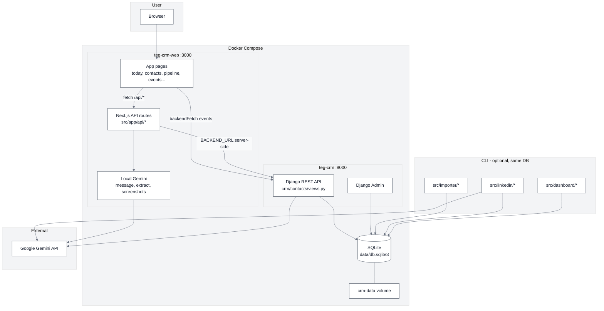
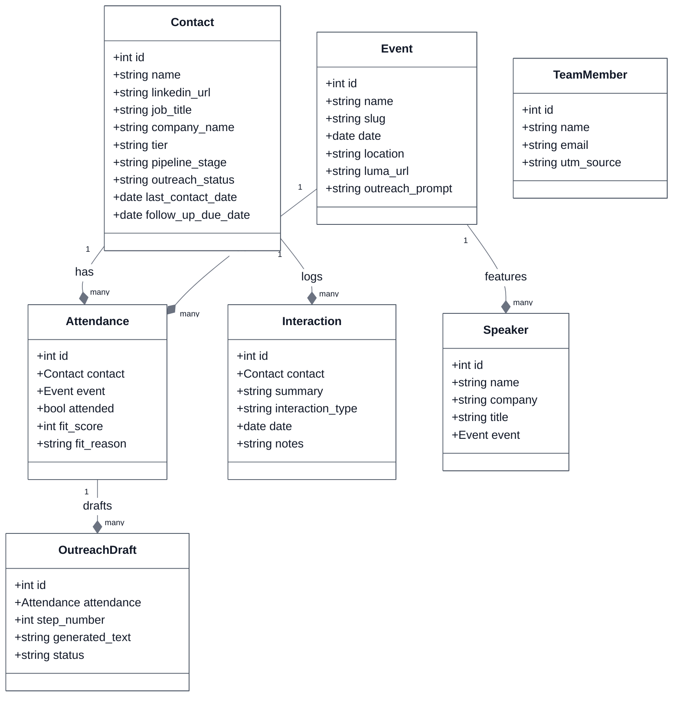
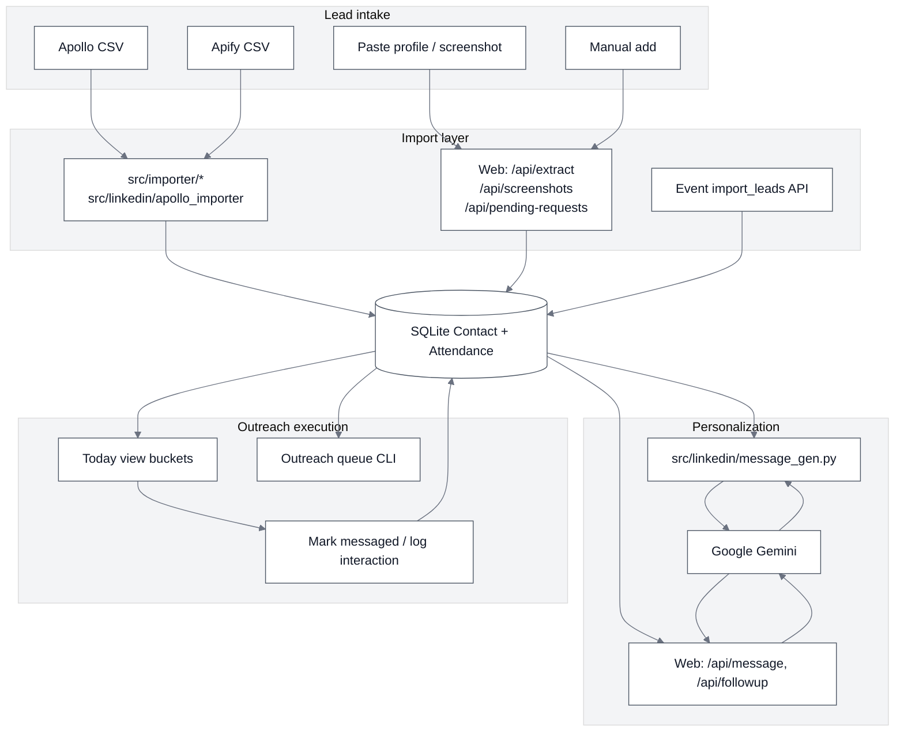

# TEG CRM Architecture

TEG CRM is a monorepo for managing LinkedIn outreach and event-attendee pipelines. It consists of:

- **[teg-crm/](teg-crm/)** — Django REST API and SQLite persistence
- **[teg-crm-web/](teg-crm-web/)** — Next.js frontend with a BFF layer and local Gemini integrations
- **[docker-compose.yml](docker-compose.yml)** — Local deployment of both services with a shared data volume

Both apps read and write the same SQLite database (`data/db.sqlite3`). Optional CLI tools in `teg-crm/src/` operate on that database outside the web stack.

---

## 1. Full-stack overview

Runtime components and how data flows between the browser, Next.js, Django, and external services.

### Auth

Two layers protect the app:

1. **App gate** — Shared `APP_PASSWORD` checked by [`teg-crm-web/middleware.ts`](teg-crm-web/middleware.ts); sets an HMAC session cookie (`teg_session`).
2. **Django JWT** — [`teg-crm-web/src/app/api/auth/login/route.ts`](teg-crm-web/src/app/api/auth/login/route.ts) exchanges credentials for a JWT from Django `/api/auth/login/`; stored in `localStorage` and sent as `Authorization: Bearer …` via [`teg-crm-web/src/lib/backend.ts`](teg-crm-web/src/lib/backend.ts).

### Backend URL split

| Context | Env var | Default (Docker) |
|---------|---------|------------------|
| Browser → Django | `NEXT_PUBLIC_BACKEND_URL` | `http://localhost:8000` |
| Next.js server → Django | `BACKEND_URL` | `http://10.89.0.1:8000` (host gateway) |

Most pages call Next `/api/*` routes (BFF), which proxy to Django server-side. The **Events** pages are an exception and call Django directly from the browser via `backendFetch`.

### Frontend Pages and API Connections

The Next.js application (`teg-crm-web/src/app`) consists of the following key pages and API integrations:

| Frontend Page | Path | Next.js API Route (BFF) | Django REST API Endpoint | Description |
|---|---|---|---|---|
| **Login** | `/login` | `/api/auth/login` | `api/auth/login/` | User authentication returning a JWT. |
| **Dashboard** | `/dashboard` | `/api/stats` | `api/contacts/stats/` | Displays overall CRM metrics and aggregations. |
| **Today** | `/today` | `/api/today`, `/api/contacts` | `api/contacts/` | Daily dashboard for immediate outreach tasks. |
| **Pipeline** | `/pipeline` | `/api/contacts/list`, `/api/contacts/[id]/stage` | `api/contacts/` | Kanban-style view to move contacts through stages. |
| **Events List** | `/events` | *Direct via `backendFetch`* | `api/events/` | Lists all TEG conferences and events. |
| **Event Details** | `/events/[slug]` | *Direct via `backendFetch`* | `api/events/[slug]/` and sub-routes | Shows event details, attendees, and imports leads. |
| **Contacts** | `/contacts` | `/api/contacts` | `api/contacts/` | Full directory of leads and contacts. |
| **Contact Detail**| `/contacts/[id]` | `/api/contacts/[id]` | `api/contacts/<id>/` | Deep-dive profile view for a specific contact. |
| **Messages** | `/messages/[id]` | `/api/message`, `/api/interactions` | `api/contacts/<id>/`, `api/attendances/` | Chat interface to generate and log AI outreach. |
| **Pending Req.** | `/pending-requests`| `/api/pending-requests/*`, `/api/events` | `api/contacts/`, `api/attendances/` | Bulk import of LinkedIn connection requests. |
| **Screenshots** | `/screenshots` | `/api/screenshots`, `/api/contacts` | `api/contacts/` | OCR/AI extraction of leads from pasted screenshots. |
| **Connections** | `/connections` | `/api/connections/create` | `api/contacts/` | Imports bulk LinkedIn connection lists. |
| **Add Contact** | `/add` | - | - | Manual UI form to add a single contact. |

### System of record

Django/SQLite is the source of truth for contacts, events, attendances, and outreach drafts. Next.js handles UI orchestration, field mapping, and Gemini-powered parsing/generation that may read or write Django data.

---

## 2. Data model

Core entities defined in [`teg-crm/crm/contacts/models.py`](teg-crm/crm/contacts/models.py).

| Entity | Role |
|--------|------|
| **Contact** | Hub — pipeline stage, outreach status, LinkedIn profile, follow-ups |
| **Event** | TEG conference — slug, prompts, Luma URL |
| **Attendance** | Contact ↔ Event join — fit_score, fit_reason |
| **Interaction** | Activity log on Contact |
| **Speaker** | Event roster (not in contact pipeline) |
| **TeamMember** | Internal team config (referenced by string, not FK) |
| **OutreachDraft** | AI message steps linked to Attendance |

### Relationships

- Contact 1→* Attendance ←* 1 Event
- Contact 1→* Interaction
- Event 1→* Speaker
- Attendance 1→* OutreachDraft

`TeamMember` is loaded from `config/team.json` and referenced on contacts by string fields (e.g. `outreach_owner`), not foreign keys.

### REST API coverage

The Django backend serves as a robust REST API over the SQLite database. Endpoints are defined using Django REST Framework (DRF) viewsets and routed via [`teg-crm/crm/urls.py`](teg-crm/crm/urls.py). 

**Available REST Endpoints:**

| Resource | Endpoints | Capabilities |
|---|---|---|
| **Auth** | `api/auth/login/` | JWT token generation using SimpleJWT. |
| **Events** | `api/events/` | List, create, retrieve, update, and delete events. |
| | `api/events/<slug>/import_leads/` | Bulk import contacts from external sources (e.g., CSV) directly to an event. |
| | `api/events/<slug>/attendances/` | Retrieve a list of attendees for a specific event. |
| | `api/events/<slug>/drafts/` | Retrieve outreach drafts specifically created for this event. |
| **Attendances** | `api/attendances/` | List and retrieve attendance relationship records. |
| | `api/attendances/<pk>/generate_message/` | Trigger Gemini-based AI generation for a personalized outreach message. |
| **Drafts** | `api/drafts/` | Create, list, retrieve, update, and delete generated outreach drafts. |
| **Contacts** | `api/contacts/` | Full CRUD operations for contacts (list, create, detail view, etc.). |
| | `api/contacts/stats/` | Aggregated statistical data used by the dashboard. |
| | `api/contacts/extract_profile/` | Helper endpoint to parse unstructured data (screenshots/text) into structured contact profiles. |

**Admin only (no REST endpoints yet):** `Interaction`, `Speaker`, `TeamMember`.

### Pipeline stages

Awareness → First Attendance → Engaged → Deepening → Activated

---

## 3. LinkedIn outreach workflow

End-to-end flow covering web UI paths and CLI tools. Both write to the same SQLite database.

### Typical paths

| Step | Web | CLI |
|------|-----|-----|
| Import leads | `/add`, `/pending-requests`, `/screenshots`, Events import | `apollo_importer.py`, `apify_importer.py`, `csv_importer.py` |
| Generate message | `/messages`, `/api/message` | `message_gen.py` |
| Review queue | `/today`, `/pipeline` | `outreach_queue.py` |
| Log sent message | `/api/messages/mark-messaged` | `message_gen.py` (logs Interaction) |
| Dashboard | `/dashboard` | `generate_dashboard.py` → static HTML |

Outreach status progresses through: Request Sent → Connected → Messaged → No Response / Withdrawn.

---

## Related docs

- [teg-crm/STRUCTURE.md](teg-crm/STRUCTURE.md) — Backend directory tree and module details
- [docker-compose.yml](docker-compose.yml) — Local deployment (Podman/Docker)
