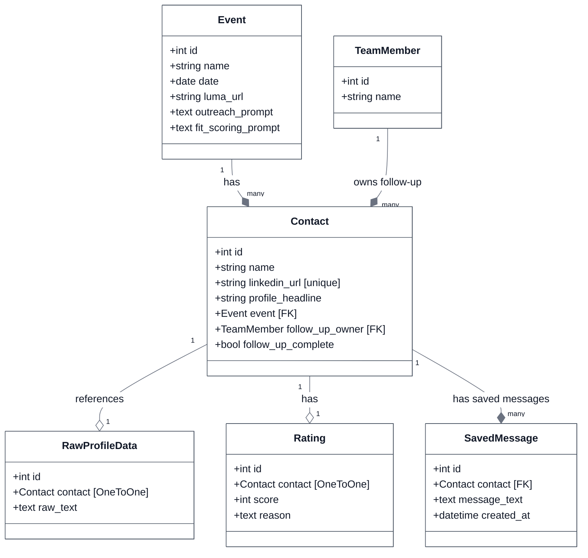
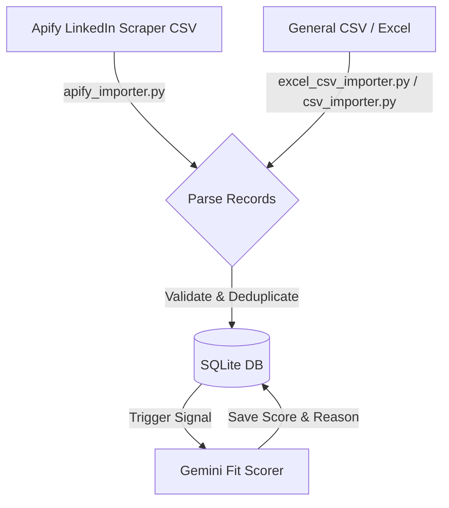
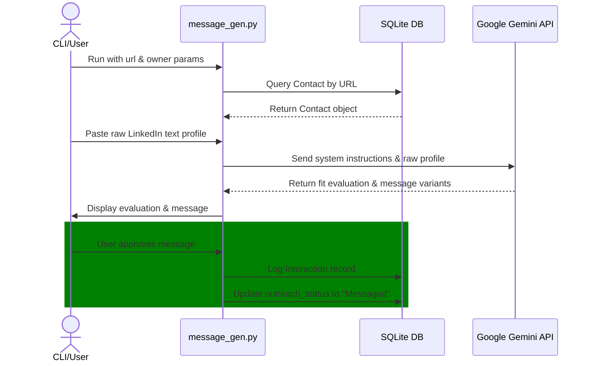
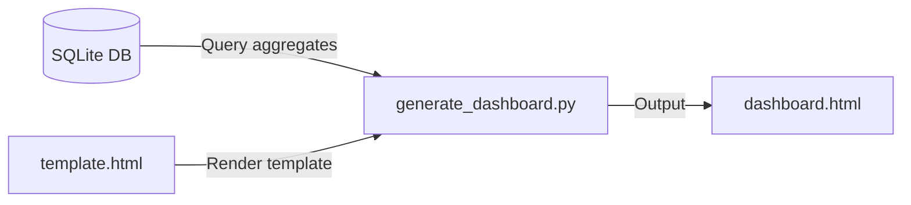
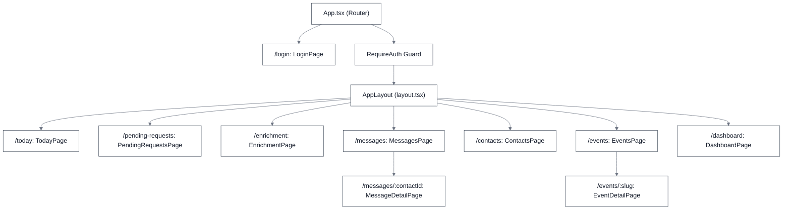
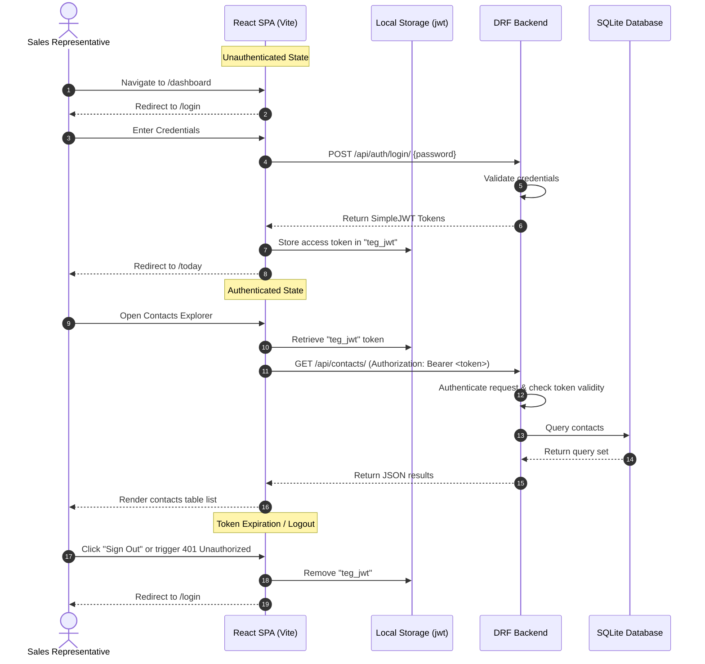

# TEG CRM Backend Architecture

This document provides a comprehensive, code-level architectural reference of the **TEG CRM** backend service (`teg-crm/`). It details the Django API engine, database models, serializers, views, and standalone CLI utilities.

For a full-stack context, the system consists of a Vite React frontend ([teg-crm-web](file:///d:/TEGProjects/TEGCRM/teg-crm-web/)) communicating with this Django REST API backend via JWT. Both services persist data into a shared SQLite database located at `data/db.sqlite3`.

---

## 📂 Backend Directory Tree

Below is the file layout of the backend engine:

```text
teg-crm/
├── crm/                         # Django Project Settings & Application
│   ├── contacts/                # Core Django App
│   │   ├── admin.py             # Custom Django admin configurations
│   │   ├── apps.py              # App config metadata
│   │   ├── models.py            # Django ORM schema definitions & signals
│   │   ├── serializers.py       # DRF serializers
│   │   └── views.py             # REST API views, viewsets, & custom actions
│   ├── settings.py              # Django settings (JWT, SQLite, CORS)
│   ├── urls.py                  # API routing definitions
│   └── wsgi.py                  # WSGI entrypoint
├── src/                         # Standalone python services & utilities
│   ├── config.py                # Environment configuration loader
│   ├── dashboard/               # HTML pipeline dashboard generator
│   │   ├── generate_dashboard.py
│   │   └── template.html
│   ├── importer/                # CSV, Excel & Apify importer scripts
│   │   ├── apify_importer.py
│   │   ├── csv_importer.py
│   │   └── excel_csv_importer.py
│   └── linkedin/                # LinkedIn automation & message generation
│       ├── apollo_importer.py
│       ├── contact_logger.py
│       ├── message_gen.py
│       └── outreach_queue.py
├── config/                      # Local JSON config (team.json)
├── data/                        # SQLite storage directory (db.sqlite3)
└── tests/                       # Pytest unit and integration test suites
```

---

## 🛠️ Django REST API Engine (`crm/`)

The REST API layer is built on **Django** and **Django REST Framework (DRF)**.

### 1. Project Configurations

* **[settings.py](file:///d:/TEGProjects/TEGCRM/teg-crm/crm/settings.py)**:
  - **Database Persistence**: Configures the default SQLite database engine mapping to `data/db.sqlite3`. Under Docker environment, this maps to a shared, persistent container volume to prevent data loss.
  - **SimpleJWT Auth**: Integrates `rest_framework_simplejwt` to secure all REST endpoints. The authorization header type is configured as `Bearer` with a default 30-day token lifetime.
  - **CORS Management**: Includes `corsheaders` middleware allowing cross-origin resource sharing from the React frontend SPA.
  - **Gemini Key**: Resolves the `GEMINI_API_KEY` from environment variables for automated messaging.
* **[urls.py](file:///d:/TEGProjects/TEGCRM/teg-crm/crm/urls.py)**:
  - Exposes Django Admin on `/admin/`.
  - Configures explicit REST url endpoints by binding viewset actions to HTTP methods.

### 2. Core CRM Models ([models.py](file:///d:/TEGProjects/TEGCRM/teg-crm/crm/contacts/models.py))

The database schema reflects the CRM pipeline entities.



#### Code-Level Data Details & Signals
- **[Contact](file:///d:/TEGProjects/TEGCRM/teg-crm/crm/contacts/models.py)**: Represents an outreach prospect. Contains fields for the LinkedIn URL, headline, associated `Event`, a `TeamMember` responsible for follow-up, and a flag indicating whether the follow-up is complete.
- **[Event](file:///d:/TEGProjects/TEGCRM/teg-crm/crm/contacts/models.py)**: Stores details about CRM events, including Luma links and dynamic AI prompts for scoring and message generation.
- **[TeamMember](file:///d:/TEGProjects/TEGCRM/teg-crm/crm/contacts/models.py)**: Represents an internal team member who owns prospect follow-ups.
- **[RawProfileData](file:///d:/TEGProjects/TEGCRM/teg-crm/crm/contacts/models.py)**: Stores the raw copy-pasted LinkedIn profile data text associated with a contact.
- **[Rating](file:///d:/TEGProjects/TEGCRM/teg-crm/crm/contacts/models.py)**: Stores AI-generated `score` ratings (1-5 scale) and the corresponding `reason` for the contact.
- **[SavedMessage](file:///d:/TEGProjects/TEGCRM/teg-crm/crm/contacts/models.py)**: Stores the outreach messages accepted/saved by users for contact follow-up.
- **Asynchronous Scoring**: Triggered upon profile enrichment. The backend runs the scoring logic calling Google Gemini (`gemini-2.5-flash`) using the contact's parsed profile details to predict a fit score and output a rationale.

### 3. API Views & Custom Actions ([views.py](file:///d:/TEGProjects/TEGCRM/teg-crm/crm/contacts/views.py))

Backend APIs are exposed through DRF generic viewsets extending `viewsets.ModelViewSet`:

* **[LoginView](file:///d:/TEGProjects/TEGCRM/teg-crm/crm/contacts/views.py#L104)**: Exposes credentials authentication. It matches a static password configuration for backend console/panel access, returning JWT access and refresh tokens.
* **[EventViewSet](file:///d:/TEGProjects/TEGCRM/teg-crm/crm/contacts/views.py#L129)**: Manages CRM events.
  - `@action attendances` (GET `/api/events/<int:pk>/attendances/`): Lists all contacts registered/associated with the specific event along with their rating score and details.
* **[TeamMemberViewSet](file:///d:/TEGProjects/TEGCRM/teg-crm/crm/contacts/views.py#L157)**: Manages CRM team members.
* **[ContactViewSet](file:///d:/TEGProjects/TEGCRM/teg-crm/crm/contacts/views.py#L162)**: Implements contacts CRUD, search filtering, and AI operations.
  - `@action stats` (GET `/api/contacts/stats/`): Calculates contact statistics (totals, stages, tiers).
  - `@action enrich` (POST `/api/contacts/enrich/`): Saves raw copied profile text to `RawProfileData` and triggers the AI fit scorer.
  - `@action generate_message` (POST `/api/contacts/<int:pk>/generate_message/`): Invokes Gemini to generate 3 personalized outreach message variants based on the event's outreach prompt and contact properties.
  - `@action save_message` (POST `/api/contacts/<int:pk>/save_message/`): Stores the user-accepted outreach message draft into the `SavedMessage` table.

### 4. Serializers ([serializers.py](file:///d:/TEGProjects/TEGCRM/teg-crm/crm/contacts/serializers.py))

* **[EventSerializer](file:///d:/TEGProjects/TEGCRM/teg-crm/crm/contacts/serializers.py#L4)**: Serializes basic event details.
* **[TeamMemberSerializer](file:///d:/TEGProjects/TEGCRM/teg-crm/crm/contacts/serializers.py#L13)**: Serializes team member fields.
* **[RatingSerializer](file:///d:/TEGProjects/TEGCRM/teg-crm/crm/contacts/serializers.py#L19)**: Serializes rating scores and reasons.
* **[RawProfileDataSerializer](file:///d:/TEGProjects/TEGCRM/teg-crm/crm/contacts/serializers.py#L25)**: Serializes profile raw texts.
* **[SavedMessageSerializer](file:///d:/TEGProjects/TEGCRM/teg-crm/crm/contacts/serializers.py#L31)**: Serializes user-accepted messages.
* **[ContactSerializer](file:///d:/TEGProjects/TEGCRM/teg-crm/crm/contacts/serializers.py#L38)**: Emits complete contact details, including nested fields for `rating`, `event`, and a list of `saved_messages`.

---

## ⚙️ Standalone Services & CLI Scripts (`src/`)

Python utility packages operated outside the HTTP server context.

### 1. Configuration Management
* **[config.py](file:///d:/TEGProjects/TEGCRM/teg-crm/src/config.py)**: Configures credentials and environment settings. Parses internal sales team information from `config/team.json`, establishing UTM tracking IDs for invitation URLs.

### 2. Lead Importers (`src/importer/`)
Parses incoming prospect listings from spreadsheets.



* **[apify_importer.py](file:///d:/TEGProjects/TEGCRM/teg-crm/src/importer/apify_importer.py)**: Imports scraped LinkedIn details (about, job title, summary, location).
* **[csv_importer.py](file:///d:/TEGProjects/TEGCRM/teg-crm/src/importer/csv_importer.py)**: Parses columns to update or build contact records.
* **[excel_csv_importer.py](file:///d:/TEGProjects/TEGCRM/teg-crm/src/importer/excel_csv_importer.py)**: Normalizes incoming file layouts to route execution paths.

### 3. LinkedIn Automation (`src/linkedin/`)
CLI scripts to drive outreach.

* **[apollo_importer.py](file:///d:/TEGProjects/TEGCRM/teg-crm/src/linkedin/apollo_importer.py)**: Special CSV parser supporting blocklists (e.g. ignoring competitors) and deduplication.
* **[contact_logger.py](file:///d:/TEGProjects/TEGCRM/teg-crm/src/linkedin/contact_logger.py)**: Terminal utility that accepts a LinkedIn URL and raw details, writing them to SQLite.
* **[message_gen.py](file:///d:/TEGProjects/TEGCRM/teg-crm/src/linkedin/message_gen.py)**: Orchestrates terminal-based outreach. It queries Gemini using a strict system prompt, checks seniority warnings (e.g. recommending Executive tickets for Directors/VPs), structures Du/Sie pronoun decisions, and prompts the user to approve logging the message to `Interaction` tables.



### 4. Static Dashboard Generation (`src/dashboard/`)
* **[generate_dashboard.py](file:///d:/TEGProjects/TEGCRM/teg-crm/src/dashboard/generate_dashboard.py)**: Runs queries against the SQLite database, compiles total aggregates, and compiles variables into `template.html` to generate a static pipeline dashboard.



---

## 💻 Frontend Client Architecture (`teg-crm-web/`)

The CRM user interface is built as a Single Page Application (SPA) using **React**, **Vite**, and **TypeScript**.

### 1. SPA Client Configuration & Security

* **Routing Setup ([App.tsx](file:///d:/TEGProjects/TEGCRM/teg-crm-web/src/App.tsx))**: Operates `react-router-dom` for client-side routing. Authenticated pages are wrapped in a `<RequireAuth>` guard which checks for a stored JWT before rendering, redirecting unauthenticated users to `/login`.
* **Authenticated Layout ([layout.tsx](file:///d:/TEGProjects/TEGCRM/teg-crm-web/src/pages/layout.tsx))**: Wraps the screen viewports with a desktop sidebar navigation panel and a mobile-friendly bottom nav bar. Provides shortcuts to all major tools and an external link to the Django admin panel dashboard.
* **REST API Middleware Client ([backend.ts](file:///d:/TEGProjects/TEGCRM/teg-crm-web/src/lib/backend.ts))**: Exposes the `backendFetch` wrapper utility. In the browser, it retrieves a relative API URL (`/api/...`) so that requests are proxied via the Vite server to the backend service. It automatically injects the stored JWT token as an HTTP `Authorization` header (`Bearer <token>`). If the backend returns a `401 Unauthorized` response, `backendFetch` invalidates the session credentials locally and redirects the user to `/login`.

### 2. UI Routing & Component Structure



---

### 3. Screen Specifications & API Interaction Mapping

#### 🔐 Login Page
* **Path**: `/login`
* **File Location**: `src/pages/login/index.tsx`
* **Functionality**: Provides a simple password entry portal for authentication.
* **Backend Integrations**:
  - `POST /api/auth/login/`: Validates static password credentials, returning simple-jwt access and refresh tokens.

#### 📅 Today's Updates Page
* **Path**: `/today` (Default root path redirect target)
* **File Location**: `src/pages/today/index.tsx`
* **Functionality**: Serves as the primary workspace dashboard daily checklist, listing top recent/active contacts due for attention.
* **Backend Integrations**:
  - `GET /api/contacts/today/`: Fetches the latest 10 contacts requiring follow-up action.

#### 📥 Bulk Import Pending Requests Page
* **Path**: `/pending-requests`
* **File Location**: `src/pages/pending-requests/index.tsx`
* **Functionality**: Bulk-registers prospects who have pending connection invitations. The sales representative pastes the raw clipboard copy of the LinkedIn "Sent" requests page. The client parses details (names, headlines), alerts the user to duplicate contacts already saved in the CRM database, and assigns a follow-up owner and target event.
* **Backend Integrations**:
  - `GET /api/events/`: Fetches events registry to populate selection choices.
  - `GET /api/contacts/?name={name}`: Performs exact name match checks to identify existing duplicate CRM prospects.
  - `POST /api/contacts/`: Registers new contact records. Payload: `{ name, outreach_owner, event_id, source: "LinkedIn" }`.

#### 👤 Enrichment Page
* **Path**: `/enrichment`
* **File Location**: `src/pages/enrichment/index.tsx`
* **Functionality**: Offers a manual copy-paste text field for pasting the raw copy-pasted layout of a contact's LinkedIn profile page. The name parsed from the first line matches the contact in the database, triggering the background Gemini scraper and scoring signal.
* **Backend Integrations**:
  - `POST /api/contacts/enrich/`: Submits profile payload. Payload: `{ raw_text }`.

#### 💬 Write Message (Search Contacts) Page
* **Path**: `/messages`
* **File Location**: `src/pages/messages/index.tsx`
* **Functionality**: A query lookup dashboard enabling sales reps to quickly search for a contact and redirect to the generator screen.
* **Backend Integrations**:
  - `GET /api/contacts/?q={query}`: Fetches matching contacts using debounced autocomplete queries, displaying current pipeline stage and outreach status badges.

#### ✉️ Message Detail Page
* **Path**: `/messages/:contactId`
* **File Location**: `src/pages/messages/[contactId]/index.tsx`
* **Functionality**: Generates and displays 3 customized outreach message variants for a specific prospect. Evaluates and displays a fit rating score (1-5), checks text character length limitations (LinkedIn limit of 300 or 500 characters), and provides copy-to-clipboard buttons.
* **Backend Integrations**:
  - `POST /api/contacts/{contactId}/generate_message/`: Invokes Gemini to evaluation-rate the prospect and output personalized German message drafts.
  - `POST /api/contacts/{contactId}/save_message/`: Saves the user-accepted outreach message text draft into the database.

#### 📇 Contacts Explorer & Detail Dialog
* **Path**: `/contacts`
* **File Location**: `src/pages/contacts/index.tsx`
* **Functionality**: Provides a filterable table interface showcasing the contact directory. Clicking any row opens a side dialog containing profile information, AI scoring details with full evaluation reasons, and dropdown selectors to update the contact's event, follow-up owner, or completion status. Also supports inline manual profile enrichment.
* **Backend Integrations**:
  - `GET /api/contacts/?q={q}&owner={owner}&page={page}`: Retrieves cursor-paginated contacts listing matched against filter conditions.
  - `GET /api/events/` & `GET /api/team/`: Retrieves configurations to populate filter and editing dropdown selectors.
  - `PATCH /api/contacts/{contactId}/`: Saves adjustments to contact fields (`event_id`, `follow_up_owner_id`, `follow_up_complete`).
  - `POST /api/contacts/enrich/`: Inlines raw profile enrichment processing.

#### 📣 Outreach Events Page
* **Path**: `/events`
* **File Location**: `src/pages/events/index.tsx`
* **Functionality**: Main registry listing all tracked outreach events. Includes dialog forms to add new events and set up target prompts for lead evaluation scoring and messaging templates.
* **Backend Integrations**:
  - `GET /api/events/`: Lists target events.
  - `POST /api/events/`: Registers a new target event. Payload: `{ name, date, luma_url, fit_scoring_prompt, outreach_prompt }`.
  - `POST /api/events/{eventId}/test_prompt/`: Dry-runs outreach prompt templates against 5 random contacts to preview and debug copy variations.

#### 📊 Event Detail Page & Pipelines
* **Path**: `/events/:slug` (mapped using event IDs)
* **File Location**: `src/pages/events/[slug]/index.tsx`
* **Functionality**: Offers a tabbed project view specifically for managing a target event's campaign:
  - **Leads**: Lists attendees mapped by AI fit score descending. Allows triggering AI evaluations per lead.
  - **Outreach Drafts**: Lists generated message drafts under review. Reps can edit text inline (`PATCH`), approve drafts, or discard them.
  - **Import Leads**: Uploads CSV or Excel spreadsheet files containing attendee lists scraped from LinkedIn (e.g., via Apify).
  - **Prompts Settings**: Modifies evaluation criteria or message templates.
* **Backend Integrations**:
  - `GET /api/events/{slug}/`: Retrieves metadata for the event.
  - `GET /api/events/{slug}/attendances/`: Retrieves attendee rows.
  - `GET /api/events/{slug}/drafts/`: Retrieves outreach drafts.
  - `POST /api/attendances/{attendanceId}/generate_message/`: Invokes lead evaluation scoring and drafts an outreach invite.
  - `PATCH /api/drafts/{draftId}/`: Saves inline edits to message texts or sets status to `Approved`.
  - `DELETE /api/drafts/{draftId}/`: Discards drafts from the queue.
  - `POST /api/events/{slug}/import_leads/`: Uploads spreadsheet files containing lead lists.
  - `PATCH /api/events/{slug}/`: Saves prompt configuration parameters.

#### 📈 Aggregate Statistics Dashboard
* **Path**: `/dashboard`
* **File Location**: `src/pages/dashboard/index.tsx`
* **Functionality**: Renders visualizations illustrating sales funnel health (total contacts, activation rates, distributions by source, tiers, and registration velocity trends) using `recharts`.
* **Backend Integrations**:
  - `GET /api/contacts/stats/`: Retrieves calculated stats aggregates.

---

### 4. Authenticated Request Integration Flow



---

## 🧪 Testing Architecture

The codebase features two test suites:

### 1. Backend Pytest Suite (`teg-crm/tests/`)
- **Environment**: Must always run inside the Django container (`teg-crm`) using `podman compose` to ensure alignment with settings and the SQLite database.
- **Command**: `podman exec -it teg-crm pytest`

### 2. Frontend Playwright E2E & Vitest Suite (`teg-crm-web/`)
- **Unit Tests**: Powered by Vitest. Runs inside the frontend container:
  - **Command**: `podman exec -it teg-crm-web npm test`
- **End-to-End System Tests**: Managed by Playwright inside the frontend container:
  - **Binary Integration**: The `Dockerfile` pre-installs native Alpine Chromium dependencies and Chromium itself, mapping them via `PLAYWRIGHT_CHROMIUM_EXECUTABLE_PATH=/usr/bin/chromium-browser` and `PLAYWRIGHT_SKIP_BROWSER_DOWNLOAD=1`.
  - **Configuration**: `playwright.config.ts` dynamically configures Chromium to execute using this path.
  - **Command**: `podman exec -e CI=true -it teg-crm-web npx playwright test`
  - **Coverage**: Includes E2E verification for sidebar navigation, event creation (with Luma URL formatting validations), contacts directory updates, and profile AI-enrichment scoring.
