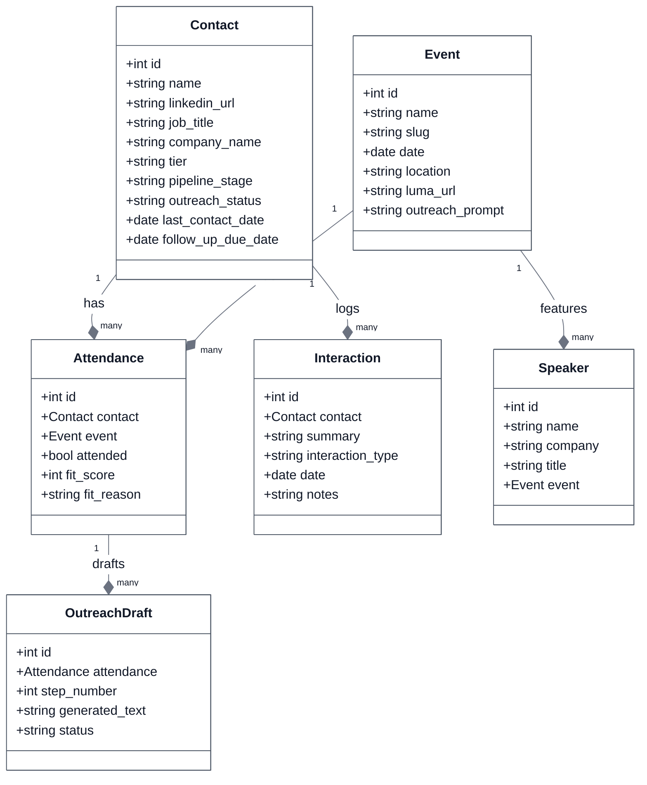
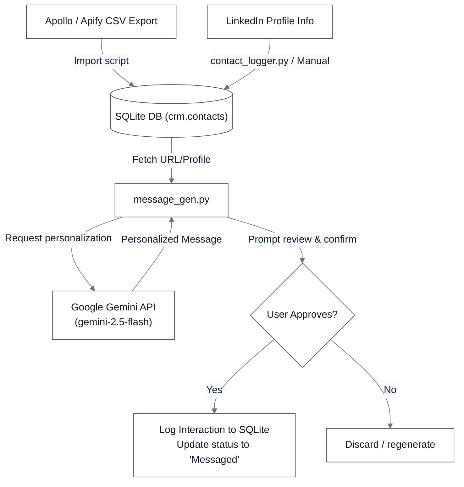

# TEG CRM Project Structure & Architecture

This document provides a comprehensive overview of the **TEG CRM** project structure, the purpose of each component, and its architectural workflows.

---

## 📂 Directory Tree

Below is the layout of the project root and its core components:

```text
teg-crm/
├── crm/                         # Django Project Settings & Application
│   ├── contacts/                # Core Django App: Models, Views, Serializers, Admin
│   ├── settings.py              # Django settings (DB, CORS, SimpleJWT, etc.)
│   ├── urls.py                  # API route definitions
│   └── wsgi.py                  # WSGI entrypoint
├── src/                         # Standalone python services & utilities
│   ├── dashboard/               # HTML pipeline dashboard generator
│   ├── importer/                # CSV & Apify importer scripts
│   ├── linkedin/                # LinkedIn outreach automation scripts (Gemini)
│   └── config.py                # Environment configuration utility
├── config/                      # Local JSON config folder
├── data/                        # SQLite storage directory (Git-ignored)
├── tests/                       # Unit and integration test suites
├── manage.py                    # Django administration CLI
└── pyproject.toml               # Poetry/Setuptools configuration and dependencies
```

---

## 🛠️ Components & Modules

### 1. Django API Engine (`crm/`)
The CRM backend is built on Django and Django REST Framework (DRF) to provide database operations, validation, and REST API access.
* **[crm/settings.py](file:///d:/TEGProjects/TEGCRM/teg-crm/crm/settings.py)**: Configures the Django settings, uses an SQLite database saved in `data/db.sqlite3` for persistence, enables SimpleJWT auth, and configures Cross-Origin Resource Sharing (CORS) for front-end integration.
* **[crm/contacts/models.py](file:///d:/TEGProjects/TEGCRM/teg-crm/crm/contacts/models.py)**: Mirrors the CRM domain schema with the following Django database models:
  * `Contact`: Stores personal details, LinkedIn profile fields, pipeline stage, and follow-up data.
  * `Event`: Represents TEG events (e.g., ACC 2026) with custom prompt templates.
  * `Attendance`: Connects contacts to events and contains the AI fit score.
  * `Interaction`: Logs communication history (emails, messages, meetings).
  * `Speaker`: Event speakers database.
  * `TeamMember`: Internal team members managing outreach.
  * `OutreachDraft`: Sequence step outreach message drafts.
* **[crm/contacts/views.py](file:///d:/TEGProjects/TEGCRM/teg-crm/crm/contacts/views.py)**: Defines REST endpoints to expose model queries, CRUD operations, and automation triggers to the frontend.
* **[crm/contacts/serializers.py](file:///d:/TEGProjects/TEGCRM/teg-crm/crm/contacts/serializers.py)**: Handlers for model serialization and deserialization.

### 2. Services & CLI Tools (`src/`)
Standalone business logic components and CLI utilities reside in `src/`.
* **[src/config.py](file:///d:/TEGProjects/TEGCRM/teg-crm/src/config.py)**: Helper dataclasses (`Config` and `TeamMember`) loaded from environment variables and `config/team.json` configuration files.
* **[src/importer/](file:///d:/TEGProjects/TEGCRM/teg-crm/src/importer)**:
  * `apify_importer.py`: Parses LinkedIn member data scraped via Apify and creates/updates `Contact` and `Attendance` records.
  * `csv_importer.py`: Standard utility to import general CSV files of contacts.
* **[src/linkedin/](file:///d:/TEGProjects/TEGCRM/teg-crm/src/linkedin)**:
  * `contact_logger.py`: Quick CLI script to log or update contacts from their LinkedIn URL.
  * `message_gen.py`: Calls Google Gemini (`gemini-2.5-flash`) using event and profile signals to generate highly personalized German outreach messages.
  * `outreach_queue.py`: CLI viewer displaying pending, connected, and messaged contacts.
  * `apollo_importer.py`: Importer for Apollo.ai exported CSVs with company blacklists and de-duplication checks.
* **[src/dashboard/](file:///d:/TEGProjects/TEGCRM/teg-crm/src/dashboard)**:
  * `generate_dashboard.py`: Query contacts from SQLite, calculate aggregates, and write the static template variables.
  * `template.html`: Frontend dashboard template.

---

## 📊 System Architecture & Relationships

To ensure text readability under both dark and light modes, the following Mermaid diagrams have been pre-styled with explicit contrasting colors.

### 1. Data Schema Architecture
This diagram displays the database tables and key relationships.



---

### 2. LinkedIn Outreach Workflow
How contacts are collected, processed, personalized via AI, and logged back to the CRM.


